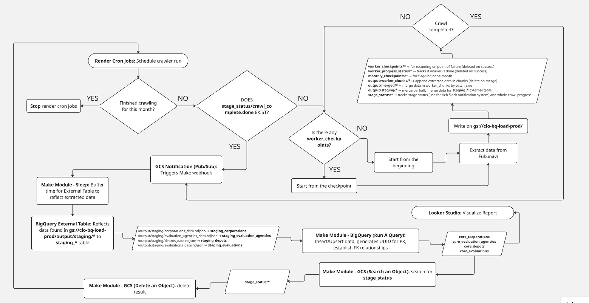

# Fukunavi Data Crawling

## Background & Objectives

- Conduct market and competitive analysis for CIO third-party evaluations
- Collect data published on Fukunavi and analyze it using BI tools such as Looker Studio
- Enable continuous information updates to perform analysis based on the latest information
- Use Cases
  - Research evaluation agencies for competitive analysis
    - If found that Evaluation Agency A has high quotes → We can prioritize proposals to this agency as they may be weak in price competition
  - Facility/corporation research for bulk sales proposals
    - When an appointment is secured with one facility, check if there are other facilities of the same corporation that could be introduced
    - Third-party evaluation requests may be decided centrally by the corporate headquarters or individually by each facility
    - This analysis will be conducted by displaying the screen alongside sales log data stored in Notion
  - Facility research for listing sales targets for the current fiscal year
    - Some service types only need third-party evaluations once every 3 years, while others require them annually
    - → To identify "this year's sales targets," we need to comprehensively identify "facilities that were evaluated 3 years ago”

## Services Used

- Fukunavi
  - A website listing information about welfare facilities in Tokyo (and surrounding areas)
    - <https://www.fukunavi.or.jp/fukunavi/>
- Playwright
  - Extract data from Fukunavi
    - <https://zenn.dev/muit_techblog/articles/e355268058acb7>
    - codegen
      - Operate the browser and automatically generate code for those operations
      - <https://zenn.dev/zenn24yykiitos/articles/3d7f582ac119b5>
- Google Cloud Platform (GCP)
  - Cloud ecosystem by Google
    - <https://cloud.google.com/products?utm_source=google&utm_medium=cpc&utm_campaign=Cloud-SS-DR-GCP-1713664-GCP-DR-APAC-JP-ja-Google-BKWS-MIX-GenericCloud&utm_content=c-Hybrid+%7C+BKWS+-+EXA+%7C+Txt+-+Generic+Cloud-Cloud+Generic-Core+GCP-JP_ja-87853815&utm_term=gcp&gclsrc=aw.ds&gad_source=1&gad_campaignid=12757824394&gclid=EAIaIQobChMI3vay-NDQkgMVR8sWBR2mRSRQEAAYASAAEgKSaPD_BwE#section-4?utm_source=google&utm_medium=cpc&utm_campaign=na-US-all-en-dr-bkws-all-all-trial-b-dr-1605212&utm_content=text-ad-none-any-DEV_c-CRE_648217100613-ADGP_Desk+%7C+BKWS+-+BRO+%7C+Txt+~+Security+~+Web+App+and+API+Protection+(WAAP)_App_Website-KWID_43700075187123980-&utm_term=KW_google%20apps%20website-ST_google+apps+website>
- Google Cloud Storage (GCS)
  - Stores Playwright `.ndjson` data
    - <https://cloud.google.com/free?utm_source=google&utm_medium=cpc&utm_campaign=Cloud-SS-DR-GCP-1713664-GCP-DR-APAC-PH-en-Google-BKWS-MIX-GenericCloud&utm_content=c-Hybrid+%7C+BKWS+-+EXA+%7C+Txt+-+Generic+Cloud-Cloud+Generic-Core+GCP-PH_en-4406040420&utm_term=google%20cloud&gclsrc=aw.ds&gad_source=1&gad_campaignid=12297519333&gclid=CjwKCAiAtLvMBhB_EiwA1u6_PjwVQ5KMZhelWmsyc3CUTV3ZRsbEVGaPRk7S_xRFw0p97rUlJnZhiRoCvB8QAvD_BwE>
- Looker Studio
  - Business Intelligence (BI) for analyzing collected data
    - <https://cloud.google.com/looker-studio?hl=en>
- BigQuery
  - Acts as data warehouse and handles data manipulation
    - <https://cloud.google.com/bigquery?utm_source=google&utm_medium=cpc&utm_campaign=Cloud-SS-DR-GCP-1713664-GCP-DR-APAC-PH-en-Google-BKWS-BRO-Others&utm_content=c-Hybrid+%7C+BKWS+-+BRO+%7C+Txt+-+Data+Analytics-Data+Analytics-BigQuery-PH_en-33969409261&utm_term=bigquery&gclsrc=aw.ds&gad_source=1&gad_campaignid=8076404546&gclid=CjwKCAiAzZ_NBhAEEiwAMtqKy5MCK55Kqkm0Gl3TMIjY-xXPzWUWbL-E2E1AndMGyOMVRxbGgfDxmxoC_DcQAvD_BwE>
- Make
  - Process automation orchestrator
    - <https://www.make.com/en>
- Render
  - Schedule crawler run
    - <https://render.com/docs/cronjobs>

## Trigger Conditions

- Update information once a month

## Process Overview

