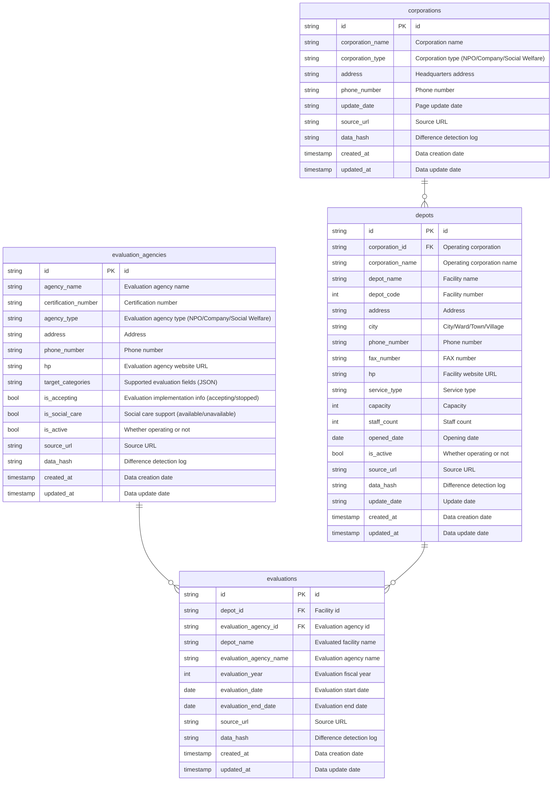

# Database Structure

> [!IMPORTANT]
> Key constraints aren't enforced in BigQuery. You are responsible for maintaining the constraints at all times. Queries over tables with violated constraints might return incorrect results.
>
> ref: <https://docs.cloud.google.com/bigquery/docs/primary-foreign-keys>

- `GENERATE_UUID()` is used to generate `PK` hence its type is `string`
- `FK` relationships are established using `BigQuery Procedure` to ensure correct data order dependencies
  - corporations → evaluation_agencies → depots → evaluations

