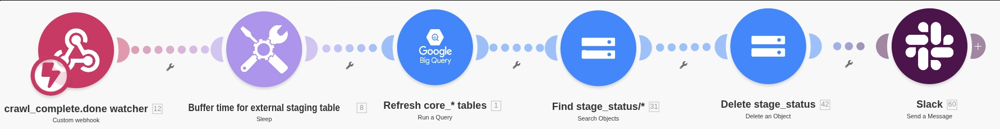
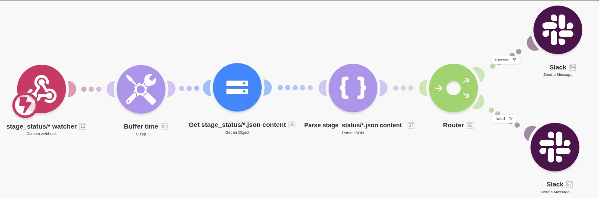

# Make

Uses Make.com as an orchestrator for the project.

### Make Scenario

#### Fukunavi (Data Manipulation & Cleanup)

Goal:

- Manipulates Data
- Cleanup GCS Data to ensure fresh succeeding runs
- Notifies to Slack when data manipulation and cleanup is done

#### Fukunavi (Slack Notifier)

Goal:

- Notifies to Slack Channel when:
  - Successful stage runs
  - Failed stage runs

